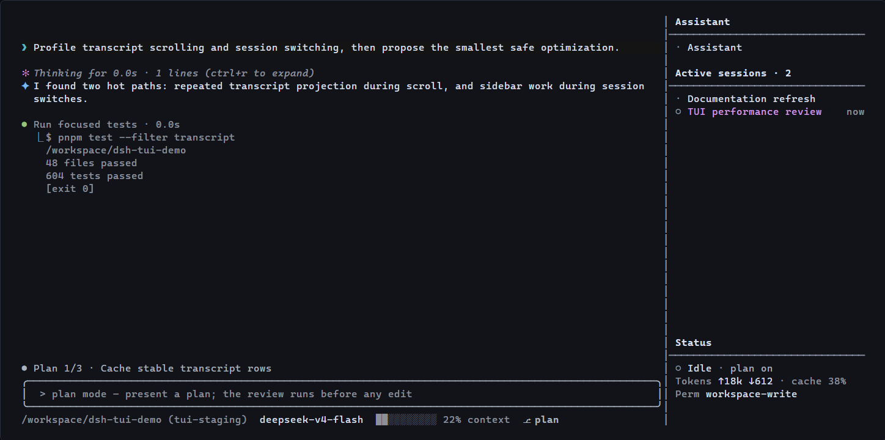

# dsh-tui-pro

[English](README.md) | [简体中文](README.zh-CN.md)

A community-maintained, full-screen terminal interface for [DeepSeek Harness](https://github.com/deepseek-ai/deepseek-harness). It keeps the conversation, input, project sessions, and agent state visible in one keyboard- and mouse-friendly workspace.



## Quick start

Install the plugin and its profile layer with one command:

```bash
dsh plugin --profile tui add @lk251066/dsh-tui
```

Then launch it from the project you want to work on:

```bash
dsh --profile tui
```

The package owns both the TUI plugin and its `cordis.patch.yml` profile layer. No separate bundle package is required.

## Core experience

| Area | Behavior |
| --- | --- |
| Conversation | Only the transcript scrolls; the input and right sidebar remain fixed. User messages, assistant Markdown, thinking, tools, diffs, plans, and subagents have distinct compact treatments. |
| Sessions | The fixed Assistant is independent of project workspaces. Active project sessions are grouped by workspace and can be opened from the sidebar or `/sessions`. |
| Input | Enter steers the running turn, Tab queues the next turn, empty Up recalls a submission, and Esc recovers the latest queued message before cancelling. |
| Models | Model and reasoning effort are stored per live session. The status row shows model, context use, memory, plan mode, and the current step's rolling output rate. |
| Files and images | `@` completes files. `Alt+V` attaches a clipboard image when the selected model advertises image input. |
| Review | Tool cards, syntax-highlighted code, word-aware diffs, approvals, and collapsible details keep implementation work readable without filling the screen with chrome. |

## Session model

The Assistant is one durable session outside every workspace. It has no project directory and does not contribute to the `Active sessions` count. It can manage active project sessions and read their completed user/assistant dialogue without receiving hidden reasoning or tool traffic.

Launching from a directory opens its first manually ordered active project session. If the directory has none, dsh creates one and adds it to that workspace. Use `/new` for another session in the current project, `/new <path>` for another project, and `/assistant` to return to the fixed Assistant.

`/quit` closes the current project session, preserves its history, and returns to the Assistant. `/exit` closes the whole TUI. Complete history remains available through `/sessions`.

## Everyday controls

| Action | Control |
| --- | --- |
| Browse complete history | `/sessions` |
| Switch active project session | `/switch`, `Alt+Left`, `Alt+Right`, or click a sidebar row |
| Close the selected project session | `/quit` or empty-input `Delete` |
| Browse current-conversation checkpoints | Double Escape |
| Toggle tool and context detail | `Ctrl+O` |
| Toggle settled reasoning | `Ctrl+R` |
| Select and copy transcript text | Drag with the left mouse button |
| Attach a clipboard image | `Alt+V` |
| Control session memory | `/memory`, `/memory on`, `/memory off` |

Run `/help` inside the TUI for the complete command list. Selectors for models, effort, skills, themes, permissions, settings, and approvals use the fixed bottom area rather than popup windows.

## Requirements

- Node.js `^22.19.0 || >=24.0.0`
- DeepSeek Harness `@deepseek-ai/dsh@0.1.0-rc.6`
- A terminal with ANSI escape-sequence support
- `DEEPSEEK_API_KEY` configured outside this repository

Clipboard image capture uses PowerShell on Windows, `pngpaste` on macOS, and `wl-paste` or `xclip` on Linux.

## Configuration

The bundled profile starts with these TUI defaults:

```yaml
- id: tui
  name: '@lk251066/dsh-tui'
  config:
    sidebarWidth: 32
    showReasoning: false
    maxToolOutputLines: 6
    maxMessageLines: 30
```

The sidebar hides below 65 inner columns. A terminal height of at least 24 rows is recommended.

## Project status

[`1.8.0`](https://www.npmjs.com/package/@lk251066/dsh-tui/v/1.8.0) is the current public release. The current source targets `1.8.1`; its source, packed-artifact, clean-profile, and real-PTY evidence is recorded in [TESTING.md](TESTING.md).

Do not use the old `v1.0.0` GitHub tag. It predates the repaired source and bundle metadata.

## Development

- [Package reference](packages/dsh-tui/README.md)
- [Development setup](DEVELOPMENT.md)
- [Verification guide](TESTING.md)
- [Implementation record](REPAIR_PLAN.md)
- [Change history](CHANGELOG.md)

On Windows, regenerate the anonymous README screenshot from the real TUI renderer with `pnpm run docs:screenshot`. The command uses an isolated in-memory demonstration and does not read a local dsh profile or API key.

## License

MIT
