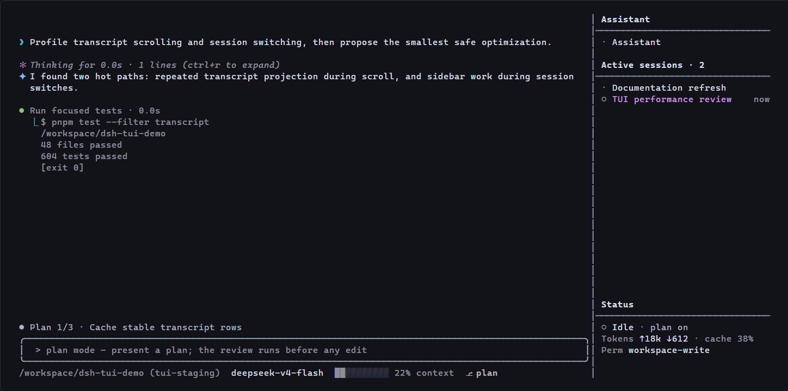

# dsh-tui-pro

[English](README.md) | [简体中文](README.zh-CN.md)

**面向 [DeepSeek Harness](https://github.com/deepseek-ai/deepseek-harness) 的多会话终端工作台。** 在一个全屏 TUI 中持续维护固定助手和多个活跃项目会话。

[](https://www.npmjs.com/package/@lk251066/dsh-tui)
[](https://github.com/lk251066/dsh-tui-pro/actions/workflows/ci.yml)
[](LICENSE)



[安装](#快速开始) · [最新版本](https://github.com/lk251066/dsh-tui-pro/releases/latest) · [dshfind](https://dshfind.com/zh/plugins/lk251066/dsh-tui-pro) · [反馈问题](https://github.com/lk251066/dsh-tui-pro/issues/new/choose)

## 快速开始

运行前需要 Node.js `^22.19.0 || >=24.0.0`，并在仓库之外配置 `DEEPSEEK_API_KEY`。

如果已经安装 [`dsh` CLI](https://github.com/deepseek-ai/deepseek-harness)，只需安装一次插件及其 profile 配置层：

```bash
dsh plugin --profile tui add @lk251066/dsh-tui
```

然后在任意项目目录中启动：

```bash
dsh --profile tui
```

没有全局安装 dsh 时，可以通过 `npx` 使用同一个 profile：

```bash
npx -y @deepseek-ai/dsh@latest plugin --profile tui add @lk251066/dsh-tui
npx -y @deepseek-ai/dsh@latest --profile tui
```

这个包同时包含 TUI 插件和 `cordis.patch.yml` profile 配置层，不需要安装第二个 bundle 包。

## 为什么选择这个 TUI

### 一个终端管理多个项目

助手是位于所有项目工作区之外的唯一持久会话。它使用永久工作目录，重启后仍继续同一段对话；上下文达到限制时由 dsh 反复压缩，完整日志和插件内的长期记忆继续保留。活跃项目会话按工作区分组并固定显示在侧边栏中。

### 稳定的全屏工作区

只有聊天记录区域滚动。输入框、当前计划、实时状态、模型、上下文用量和活跃会话保持固定；用户消息、Markdown、思考、工具、diff、计划、todo 和子代理使用紧凑且可区分的样式。

终端标题始终保留当前会话名称。存在正在执行的会话时，标题会显示低频动画和当前运行会话总数，支持该终端协议的环境也会在任务栏显示进度状态。

### 使用原生 DeepSeek Harness 组合

这个包是独立于 dsh 仓库的插件 bundle，不是 Harness 分支。会话、工具、skills、模型、权限、上下文压缩和子代理仍然使用当前 dsh profile 提供的服务。

## 会话工作流

在某个目录启动时，会打开该目录中手动排序最靠前的活跃项目会话。如果不存在，dsh 会新建会话并加入该工作区。

- `/new` 在当前项目中创建另一个会话。
- `/new <路径>` 为另一个项目创建会话。
- `/assistant` 返回固定助手。
- `/switch`、`Alt+Left`、`Alt+Right` 或点击侧边栏可以切换活跃项目会话。
- `/quit` 关闭当前项目会话、保留历史并返回助手。
- `/sessions` 浏览完整历史；`/exit` 关闭整个 TUI。

助手可以管理活跃项目会话，并读取其中已完成的用户和助手对话。隐藏思考、工具过程和未完成输出不会跨会话暴露。

助手最终回复始终完整显示，长内容只通过聊天区域滚动查看。思考和工具正文可以收起，但工具名称、状态和错误始终可见。助手默认启用长期记忆，旧记录不会因达到固定条数而被静默删除；`/memory off` 只停止当前会话使用记忆，不删除已保存内容。

## 交互方式

| 操作 | 指令或按键 |
| --- | --- |
| 当前回合中立即追加消息 | `Enter` |
| 将消息排到下一回合 | `Tab` |
| 取消前取回最新排队消息 | `Esc` |
| 恢复最近一次提交 | 空输入时按 `Up` |
| 浏览当前对话检查点 | 双击 `Esc` |
| 切换工具和上下文正文详情 | `Ctrl+O` |
| 展开已完成的思考 | `Ctrl+R` |
| 选择并复制聊天文本 | 按住鼠标左键拖动 |
| 附加剪贴板图片 | `Alt+V` |
| 控制当前会话记忆 | `/memory`、`/memory on`、`/memory off` |

运行 `/help` 可以查看完整指令。模型、思考等级、skills、主题、设置、权限、问题和审批选择器都在底部固定区域显示，不使用居中弹窗。

## 图片与终端

`@` 可以补全工作区文件。所选模型明确支持图片输入时，`Alt+V` 可附加剪贴板图片。Windows 使用 PowerShell 读取图片，macOS 需要 `pngpaste`，Linux 需要 `wl-paste` 或 `xclip`。

TUI 需要支持 ANSI 转义序列的终端。内部宽度低于 65 列时侧边栏会隐藏，建议终端高度至少为 24 行。

## 配置

```yaml
- id: tui
  name: '@lk251066/dsh-tui'
  config:
    sidebarWidth: 32
    assistantCwd: '/助手目录的绝对路径'
    showReasoning: false
    maxToolOutputLines: 6
```

支持的入口和组合插件导出见[包参考](packages/dsh-tui/README.md)。

## 项目链接

- [npm 包](https://www.npmjs.com/package/@lk251066/dsh-tui)
- [GitHub Releases](https://github.com/lk251066/dsh-tui-pro/releases)
- [社区讨论](https://github.com/lk251066/dsh-tui-pro/discussions)
- [开发环境](DEVELOPMENT.md)
- [验证说明](TESTING.md)
- [变更记录](CHANGELOG.md)
- [参与贡献](CONTRIBUTING.md)

这个插件跟随处于开发者预览阶段的 dsh 版本线。每个版本发布前都会验证源码、npm 打包产物、干净的公开 dsh profile 和真实 Linux PTY。


## 许可证

[MIT](LICENSE)。基于 [DeepSeek Harness](https://github.com/deepseek-ai/deepseek-harness) 的原始 TUI 实现。
